# 🏠 Agentic Mortgage Research Agent

A hands-on AI project demonstrating **intelligent agent reasoning** with real LLM integration. This agent autonomously researches US mortgage rates and home prices, uses Claude AI to make intelligent decisions about data fetching, and generates insightful analysis.

## 📖 Table of Contents

- [Tech Stack](#-tech-stack-recruiter-friendly)
- [Agentic AI Highlights](#-agentic-ai-highlights)
- [What This Demonstrates](#-what-this-demonstrates)
- [Quick Start](#-quick-start)
- [Architecture](#-architecture) ⭐ **Includes 5 Mermaid Diagrams** | [Deep Dive →](ARCHITECTURE.md)
  - [System Architecture Diagram](#system-architecture-diagram)
  - [Multi-Agent Execution Flow](#multi-agent-execution-flow)
  - [Data Flow Architecture](#data-flow-architecture)
  - [Component Dependencies](#component-interaction--dependencies)
  - [Deployment Architecture](#deployment-architecture-production-ready)
- [LLM Integration Details](#-llm-integration-details)
- [Configuration](#️-configuration)
- [Monitoring & Logs](#-monitoring--logs)
- [Learning & Extension](#-learning--extension-points)
- [Tech Stack Details](#-tech-stack-details)
- [Security](#-security-notes)
- [License](#-license)

---

## ✅ Tech Stack (Recruiter Friendly)

- **Language**: Python 3.x
- **LLM**: Anthropic Claude (planning + insights)
- **Data**: FRED API, pandas, requests
- **Visualization/UI**: Streamlit, Altair
- **Agent Orchestration**: Custom agent planner + knowledge base
- **Config/Security**: python-dotenv, Streamlit secrets

## 🤖 Agentic AI Highlights

- **Multi-Agent Architecture**: Three specialized roles (Planner, Market Analyst, Risk Officer) provide diverse perspectives on market data
- **Multi-Round Debate System** 🆕: Agents engage in 3-round debates with cross-examination and consensus building
- **Historical Learning** 🆕: SQLite database stores all debates with outcome validation against actual market movements
- **LLM-Driven Planning**: Claude decides which actions to execute based on knowledge state
- **Real-Time Visualization**: Color-coded perspective cards with markdown rendering
- **Orchestration**: Selects actions from knowledge state and runs them in sequence
- **Decision Transparency**: Complete decision trace logged in UI with emoji-based filtering
- **Cost Tracking**: Real-time LLM API cost monitoring per session
- **Graceful Fallback**: Heuristics when LLM unavailable

## 🎯 What This Demonstrates

### ✅ Hands-On AI Capabilities
- **LLM-Based Reasoning**: Uses Claude 3.5 Sonnet to decide which actions to execute based on current knowledge state
- **Real Data Integration**: Fetches live economic data from Federal Reserve (FRED API)
- **Intelligent Planning**: Agent determines if data needs refreshing, correlates market signals, and chains dependent actions
- **Production-Grade Architecture**: Clean separation of concerns, configuration management, error handling

### 🧠 Agent Behavior

The agent follows a intelligent decision flow:

1. **Plan (LLM-Driven)**: Analyzes current knowledge state and decides:
   - Should mortgage rates be refreshed? (checks recency and force flag)
   - Should rates be analyzed? (only if data is new)
   - Should home prices be fetched? (only if rates changed significantly)
   - How should insights be generated?

2. **Execute**: Runs planned actions in sequence
3. **Analyze**: Generates insights using Claude to interpret data
4. **Inform**: Updates the dashboard with findings

### Key Features
- **LLM Planning**: Claude decides what data to fetch based on knowledge state
- **Multi-Agent Perspectives**: Three specialized roles analyze the same data:
  - **📊 Planner**: Focuses on action selection and sequencing
  - **📉 Market Analyst**: Interprets data and identifies trends
  - **🛡️ Risk Officer**: Evaluates risks and establishes guardrails
- **LLM Insights**: Claude analyzes data and generates actionable insights
- **Dynamic UI**: Color-coded perspective cards with HTML/CSS styling and markdown rendering
- **Graceful Fallback**: If LLM unavailable, uses heuristic-based planning
- **Real-Time Logging**: Transparent decision-making with emoji-filtered role execution tracking
- **Interactive Dashboard**: Streamlit UI with granular controls (Agentic Plan, Regenerate Summary, Regenerate Perspectives)

### 🔥 Multi-Round Debate System (v1.3.0)

The debate system demonstrates true agentic autonomy where agents:

**Round 1: Initial Positions**
- Each agent independently analyzes market data
- Presents their stance (BULLISH/BEARISH/NEUTRAL) with confidence levels
- Documents reasoning with 3-4 key points

**Round 2: Cross-Examination**
- Agents review peers' positions
- Challenge assumptions or provide supporting evidence
- Respond with specific critiques referencing other agents' arguments

**Round 3: Consensus Building**
- Agents cast final votes after considering all perspectives
- System calculates consensus score and average confidence
- Final recommendation generated from majority vote

**Historical Learning**
- All debates stored in SQLite database
- Outcome validation: Compare predictions vs. actual market movements
- Accuracy tracking: Monitor agent prediction performance over time
- Audit trail: Complete record of reasoning for every decision

**Why This Matters**: Agents aren't just executing pre-programmed responses—they're engaging in dynamic discourse, self-correcting, and learning from outcomes. This showcases emergent intelligence and sophisticated multi-agent collaboration.

### 🎮 User Experience Flow

**Automatic Round 1 (No Click Required)**
1. Run "Agentic Plan" → Data fetched, analyzed, and Round 1 positions automatically generated
2. See 3 color-coded agent positions with confidence levels displayed immediately
3. Each agent has independently analyzed the market and staked a position

**Interactive Debate Continuation**
4. Click "Continue to Full Debate" button → Rounds 2 & 3 are generated
5. **Round Selection**: Use buttons to switch between Round 1/2/3 views
6. **Unified 3-Column Layout**: See all agents' responses side-by-side for each round:
   - Round 1: Initial positions with confidence levels
   - Round 2: Cross-examination with peer critiques
   - Round 3: Final votes with consensus
7. Full debate results saved to database with outcome validation

**This design showcases the system immediately** (Round 1 always visible) while letting users **opt into the full debate** to see cross-examination and consensus building. The consistent 3-column layout makes it easy to compare agent reasoning throughout all stages.

---

## 🧠 What's New in v1.3.5 (AI Learning Enabled)

**v1.3.5** implements the **core AI learning functionality** - agents now actively improve their decisions based on historical patterns from validated debates.

### Key Features
- **Pattern Extraction from Validation**: When you validate a debate outcome, the system automatically extracts market patterns (conditions, prediction types, accuracy)
- **Agent Pattern Reference**: All three agents now receive learned patterns in their prompts during each debate round
  - **Round 1**: Agents see top patterns when forming initial positions
  - **Round 2**: Patterns inform cross-examination challenges and counter-arguments
  - **Round 3**: Patterns guide final confidence scoring and voting decisions
- **Learned Patterns Dashboard**: New **"📚 Learned Patterns"** section shows accuracy and frequency of discovered patterns
- **End-to-End Feedback Loop**: Validate outcome → Extract patterns → Future agents reference patterns → Improved predictions

### Technical Implementation
- **Database Schema**: Added `lessons_learned` table for persistent pattern storage
- **Pattern Methods**: Three new database methods
  - `extract_pattern_from_validation()`: Captures patterns when debates are validated
  - `get_learned_patterns()`: Retrieves top patterns by accuracy and frequency
  - `get_patterns_summary_for_agents()`: Generates human-readable summaries for agent prompts
- **Agent Integration**: Updated all three debate rounds to inject pattern context into LLM prompts
- **UI Display**: Patterns ranked by accuracy (%) and frequency (# of times observed)

### How It Works
1. Run a debate → Agents get current rate data
2. Validate the outcome → System extracts "BULLISH 75% accurate when inflation falling" patterns
3. Run next debate → New agents see the learned patterns in their context
4. Over time → Agent predictions improve as they reference historical lessons

**Foundation for**: Future AI self-improvement, cross-validation analysis, and prediction confidence calibration.

### Previous Release

## 📊 What's New in v1.3.4 (Stable Baseline - Learning Ready)

**v1.3.4** is a stable checkpoint before implementing **AI learning from outcome validation**. This release stabilizes all UX improvements and performance optimizations.

### Key Updates
- **Sidebar consistency**: All sections now have emoji icons for visual scanning
- **Collapsible data visualization**: Market charts hidden by default, expandable on-demand
- **Full prediction history tracking**: Accuracy chart now shows all debates (validated + pending) for complete learning trajectory
- **iOS dark mode fixes**: Text visibility restored on iPhone 13 Chrome while preserving blue theme
- **Consensus clarity**: Fixed 2-1 vs 3-0 messaging confusion (majority decision vs unanimous)

### Technical Foundation
- All validation infrastructure in place for upcoming learning system
- Historical debate database with outcome tracking ready for pattern extraction
- UI/UX fully stabilized for feature additions

**Status**: Learning system implemented in v1.3.5.

### Previous Release


## 🆕 What's New in v1.3.3 (UX Polish)

**v1.3.3** focuses on **debate workflow smoothness**, **honest consensus framing**, and **clearer result presentation**.

### Key Improvements
- **Instant Start Debate feedback**: Spinner now appears immediately when you click the button (no delay)
- **Removed redundant messaging**: Success confirmation no longer flashes and disappears
- **Auto-advance to results**: After debate completes, app automatically shows Round 2 cross-examination
- **Consensus at top**: Final consensus now displays first for quick decision-making
- **Honest disagreement display**: When all 3 agents vote differently (1-1-1 tie), it now shows "⚪ Agents Fundamentally Disagree" with gray styling—reflecting real market uncertainty rather than claiming false consensus
- **Better consensus explanations**: Dynamically explains the difference between unanimous (3-0), slight majority (2-1), and complete disagreement (1-1-1)

### Previous Release

**v1.3.2** (Hotfix Rollup) focused on **debate execution reliability**, **data fetch resilience**, and **clearer consensus messaging**.

### Debate Execution & UX
- **Start Debate Reliability**: Prevents duplicate buttons and hides the control while a debate is running
- **Initialization Guard**: Debate controls stay hidden until auto-initialization completes
- **Cooldown Logic Fixes**: Cooldown starts only after successful LLM runs and resets on first load
- **Consensus Clarity**: Final summary now shows a readable vote breakdown with consensus strength and confidence

### Data & Infrastructure Resilience
- **FRED API Retries/Timeouts**: Automatic retries with timeouts and graceful fallback to cached data
- **Empty Data Guards**: Prevents crashes when rate/price data is missing or incomplete
- **Streamlit Deprecations**: Replaced `use_container_width` with `width="stretch"`

### Bug Fixes
- **Session State Reference**: Fixed `first_run` NameError by using session state consistently

**Migration from v1.3.2**: No breaking changes. Pull latest code and reboot Streamlit to pick up the UX improvements.

---

## 🚀 Quick Start

### Prerequisites
- Python 3.8+
- Anthropic API key (get one at https://console.anthropic.com)

### Setup

1. **Clone/setup the project**:
   ```bash
   cd PyCharmMiscProject
   ```

2. **Install dependencies**:
   ```bash
   pip install -r requirements.txt
   ```

   The requirements file is pinned to the exact package versions used in the current environment.

3. **Configure API key** (choose one):
    - **Streamlit secrets** (local): create `.streamlit/secrets.toml` and set:
       ```toml
       ANTHROPIC_API_KEY = "sk-ant-xxx..."
       ```
      This file is ignored by git and must be created on each local machine.
    - **Environment file**: copy `.env.example` to `.env` and set:
       ```
       ANTHROPIC_API_KEY=sk-ant-xxx...
       ```

4. **Run the dashboard**:
   ```bash
   python run_dashboard.py
   ```
   
   The dashboard opens at `http://localhost:8501`

### Local Secrets Quickstart

After you pull the repo on a new machine, copy the template secrets file and add your key:

```bash
cp .streamlit/secrets.toml.example .streamlit/secrets.toml
```

Then edit `.streamlit/secrets.toml` and set:

```toml
ANTHROPIC_API_KEY = "sk-ant-xxx..."
```

### First Run Checklist

- Create `.streamlit/secrets.toml` (from the example) or set `.env` with `ANTHROPIC_API_KEY`.
- Install dependencies with `pip install -r requirements.txt`.
- Start the app with `python run_dashboard.py`.

---

## 📊 Architecture

> 📘 **For detailed technical documentation**, see [ARCHITECTURE.md](ARCHITECTURE.md)  
> Includes: System layers, component deep dive, ADRs, deployment strategies, testing approaches, and scalability plans.

### Components

**AgenticMortgageResearchAgent** (`AgenticMortgageResearchAgent.py`)
- Core agent with knowledge base and action methods
- LLM-based planning: `_llm_based_plan()` - Claude decides what to do
- LLM-based analysis: `_llm_based_insights()` - Claude generates insights
- Heuristic fallback: Works without LLM using rule-based logic

**Dashboard** (`dashboard.py`)
- Streamlit UI with real-time updates and status widget
- **Unified 3-Column Debate Interface**: All rounds displayed side-by-side for easy agent comparison
- **Round Selection Buttons**: Switch between Round 1, 2, and 3 to see each stage of debate
- **Agent-Specific Colors**: Each agent has distinct visual identity:
  - **📊 Planner**: Blue theme (#0a74da)
  - **📉 Market Analyst**: Green theme (#00c48c)
  - **🛡️ Risk Officer**: Red theme (#e53e3e)
- Markdown-to-HTML conversion for proper formatting of LLM outputs
- **Compact Layout**: Optimized spacing throughout for cleaner presentation
- Data visualizations (mortgage rates, home prices, normalized comparison)
- Agent logs with 3-way filtering (All logs / LLM decisions / Role outputs)
- Interactive controls:
  - **Agentic Plan**: Full orchestration with automatic Round 1 generation
  - **Continue to Full Debate**: Progressive disclosure for Rounds 2 & 3
  - **Regenerate Round 1**: Refresh initial positions
  - **Run Full Debate**: Complete 3-round debate from scratch
  - **Clear Logs**: Resets decision trace
- Collapsible sidebar sections (About, Documentation, Tech Stack, System Design, Agent Controls, Outcome Validation, Logs)

**Configuration** (`config.py`)
- Centralized settings (API keys, cache windows, thresholds)
- Environment variable support
- Feature flags for LLM vs heuristic mode

### System Architecture Diagram

```mermaid
graph TB
    subgraph "User Interface Layer"
        UI[Streamlit Dashboard<br/>dashboard.py]
        Cards[Color-Coded<br/>Perspective Cards]
        Viz[Data Visualizations<br/>Altair Charts]
        Logs[Agent Logs<br/>3-Way Filter]
    end
    
    subgraph "Agent Orchestration Layer"
        Agent[AgenticMortgageResearchAgent<br/>Core Logic]
        Planner[LLM-Based Planner<br/>Claude 3.5]
        Actions[Action Methods<br/>fetch/analyze/compare]
        KB[Knowledge Base<br/>In-Memory Cache]
    end
    
    subgraph "Multi-Agent System"
        RolePlanner[📊 Planner Role<br/>Action Sequencing]
        RoleAnalyst[📉 Market Analyst<br/>Data Interpretation]
        RoleRisk[🛡️ Risk Officer<br/>Risk Assessment]
    end
    
    subgraph "External Services"
        Claude[Anthropic Claude API<br/>LLM Planning & Insights]
        FRED[FRED Economic Data API<br/>Mortgage Rates & Housing]
    end
    
    subgraph "Configuration"
        Config[config.py<br/>Settings & Secrets]
        Secrets[.streamlit/secrets.toml<br/>API Keys]
        Env[.env<br/>Environment Variables]
    end
    
    UI --> Agent
    Agent --> KB
    Agent --> Planner
    Planner --> Claude
    Agent --> Actions
    Actions --> FRED
    Actions --> KB
    
    Agent --> RolePlanner
    Agent --> RoleAnalyst
    Agent --> RoleRisk
    RolePlanner --> Claude
    RoleAnalyst --> Claude
    RoleRisk --> Claude
    
    KB --> Cards
    KB --> Viz
    Agent --> Logs
    
    Config --> Agent
    Secrets --> Config
    Env --> Config
    
    style UI fill:#e3f2fd
    style Agent fill:#fff3e0
    style Claude fill:#f3e5f5
    style FRED fill:#e8f5e9
    style KB fill:#fff9c4
```



### Multi-Agent Execution Flow

```mermaid
sequenceDiagram
    participant User
    participant Dashboard
    participant Agent
    participant Planner as 📊 Planner Role
    participant Analyst as 📉 Market Analyst
    participant Risk as 🛡️ Risk Officer
    participant Claude as Claude API
    participant FRED as FRED API
    participant KB as Knowledge Base
    
    User->>Dashboard: Click "Agentic Plan"
    Dashboard->>Agent: agentic_plan()
    
    Agent->>Planner: Evaluate system state
    Planner->>Claude: "What actions needed?"
    Claude-->>Planner: ["fetch_rates", "analyze", "generate_perspectives"]
    
    Agent->>FRED: fetch_mortgage_rates()
    FRED-->>KB: Store rates data
    
    Agent->>KB: analyze_rates()
    KB-->>KB: Compute statistics
    
    Agent->>Planner: Generate perspective
    Planner->>Claude: "Plan next actions..."
    Claude-->>Planner: Planner insights
    
    Agent->>Analyst: Generate perspective
    Analyst->>Claude: "Analyze market trends..."
    Claude-->>Analyst: Analyst insights
    
    Agent->>Risk: Generate perspective
    Risk->>Claude: "Evaluate risks..."
    Claude-->>Risk: Risk insights
    
    KB-->>Dashboard: Update perspectives cards
    Dashboard-->>User: Display multi-agent insights
```



### Data Flow Architecture


### Component Interaction & Dependencies


### Deployment Architecture (Production Ready)


**Key Architecture Decisions:**

1. **Stateless Application**: Agent knowledge stored per-session for horizontal scaling
2. **LLM Caching**: 24-hour cache validity reduces API costs and latency
3. **Graceful Degradation**: Heuristic fallback when Claude API unavailable
4. **Async-Ready**: Current implementation synchronous, easily adaptable to async/await
5. **Security by Default**: API keys never committed, secrets.toml gitignored
6. **Real-Time Feedback**: Callback-based logging enables streaming updates to UI
7. **Modular Design**: Clean separation allows easy testing and mocking

---

## 🤖 LLM Integration Details

### Planning Phase
The agent sends Claude its current knowledge state and receives a JSON response:
```json
{
  "actions": ["fetch_mortgage_rates", "analyze_rates", "summarize_insights"],
  "reasoning": "Rates are stale (>24h), new fetch needed. Home prices up-to-date."
}
```

Claude considers:
- Data recency (when was it last fetched?)
- Whether force refresh is requested
- Data dependencies (don't analyze rates until they're fetched)
- Correlation signals (if rates changed >0.25%, fetch home prices too)

### Insights Phase
Claude analyzes the data context and generates actionable insights:
```
You are a mortgage market analyst. Analyze the following data:
- Current rate: 7.45%
- 12-month average: 6.89%
- Trend: Rates Elevated
- Home prices: rising year-over-year

Provide assessment, implications for homebuyers, and key insight.
```

### Multi-Agent Perspectives

The system generates three specialized perspectives on the same data:

**📊 Planner**
- Analyzes action selection and sequencing decisions
- Evaluates system state and workflow optimization
- Focuses on orchestration strategy

**📉 Market Analyst**
- Interprets mortgage rate trends and economic signals
- Identifies market patterns and correlations
- Provides data-driven market insights

**🛡️ Risk Officer**
- Assesses risk signals and market volatility
- Establishes guardrails and safety thresholds
- Highlights potential concerns for stakeholders

Each role receives the same context (summary, rates, trends, home prices) but responds from their professional perspective with 2-3 concise bullet points. This demonstrates a sophisticated multi-agent architecture where diverse viewpoints enhance analysis quality.

---

## 📈 How the Agent Reasons

### Example: Intelligent Fetching

**Scenario 1: First Run**
```
LLM Decision: "All data missing, fetch everything"
→ Actions: [fetch_mortgage_rates, analyze_rates, fetch_home_prices, compare, summarize]
```

**Scenario 2: Daily Check**
```
LLM Decision: "Rates are 6 hours old (fresh), rates haven't changed, skip fetch"
→ Actions: [summarize_insights]  # Fast path
```

**Scenario 3: Rate Spike**
```
LLM Decision: "Rates changed 0.35%, correlation broken, refetch home prices"
→ Actions: [fetch_home_prices, compare_with_home_prices, summarize_insights]
```

The LLM does this reasoning, not hardcoded rules!

---

## 🛠️ Configuration

Edit `config.py` to customize:

```python
# Cache validity
CACHE_VALIDITY_HOURS = 24

# Market sensitivity
RATE_CHANGE_THRESHOLD = 0.25  # percentage points

# LLM Settings
ENABLE_LLM_PLANNING = bool(ANTHROPIC_API_KEY)
MODEL_NAME = "claude-3-5-sonnet-20241022"
```

---

## 🔍 Monitoring & Logs

The dashboard displays:
- 📊 Live data visualizations (rates, prices, normalized comparison)
- 🧠 Multi-agent perspectives in color-coded cards
- 📝 Agent logs with timestamps and 3-way filtering:
  - **All logs**: Complete decision trace
  - **LLM decisions only**: Claude's planning and reasoning
  - **Role outputs only**: Emoji-tagged role execution (📊📉🛡️📈🔍💡🧠)
- 🚨 Real-time status widget during agent execution
- ⚠️ Error messages with fallback behavior

Example log output:
```
[14:23:45] 📊 Planner: Evaluating system state and data freshness...
[14:23:46] 📈 Data Collector: Fetching mortgage rates from FRED...
[14:23:47] Running action: fetch_mortgage_rates (force=False)
[14:23:48] Mortgage rates fetched.
[14:23:49] 🔍 Market Analyst: Analyzing mortgage rate trends...
[14:23:50] 📊 Planner: Analyzing data and generating perspective...
[14:23:51] 📉 Market Analyst: Analyzing data and generating perspective...
[14:23:52] 🛡️ Risk Officer: Analyzing data and generating perspective...
[14:23:53] Multi-agent perspectives generated successfully.
```

---

## 🧪 Testing LLM Integration

### Without API Key
If `ANTHROPIC_API_KEY` is not set, the agent automatically falls back to heuristic-based planning. You can still use the dashboard; it just won't use Claude for decisions.

### With API Key
Set your key in `.env` and the LLM features activate automatically.

### Forcing Heuristic Mode (for comparison)
Edit the `config.py` and set `ENABLE_LLM_PLANNING = False` to test heuristic vs LLM behavior.

---

## 🎓 Learning & Extension Points

### What I Built
1. **Multi-Agent Architecture**: Three specialized roles providing diverse analytical perspectives
2. **Multi-Step Agent Orchestration**: Planning → Execution → Analysis → UI
3. **LLM Integration Patterns**: Prompting for structured decisions + insights generation
4. **Real-Time UI Feedback**: Emoji-based role tracking with status widgets and callbacks
5. **Dynamic Content Rendering**: Markdown-to-HTML conversion for formatted LLM outputs
6. **Graceful Degradation**: Full functionality with or without LLM
7. **Real Data Pipelines**: API integration, caching, error handling
8. **Intelligent Reasoning**: Agent makes decisions, humans don't hardcode them

### Future Enhancements
- [ ] Add more specialized roles (Technical Analyst, Economic Forecaster)
- [ ] Implement role debate/consensus mechanisms
- [ ] Persistence layer (save/load agent state)
- [ ] Multi-turn LLM conversations for complex analysis
- [ ] Async action execution for faster processing
- [ ] More data sources (unemployment, inflation, consumer sentiment)
- [ ] Risk modeling with LLM-based scenario analysis
- [ ] Historical perspective comparisons (track how analysis changes over time)
- [ ] Unit tests with mocked FRED API responses
- [ ] Docker containerization
- [ ] CI/CD pipeline

---

## 📚 Tech Stack Details

- **Language**: Python 3.14+ (virtual environment)
- **LLM**: Anthropic Claude 3.5 (claude-3-haiku-20240307 for perspectives)
- **Data**: pandas 2.3.3, FRED Economic Data API, requests 2.32.5
- **Visualization/UI**: Streamlit 1.54.0, Altair 6.0.0
- **Agent Orchestration**: Custom multi-agent planner with role-based perspectives
- **UI Rendering**: HTML/CSS for dynamic styled components
- **Config/Security**: python-dotenv 1.2.1, Streamlit secrets (.gitignored)

### Pinned Dependencies

The exact installed dependency set (51 packages) is captured in [requirements.txt](requirements.txt) to ensure reproducible runs across environments.

---

## 🔐 Security Notes

- API keys stored in `.env` (never committed to git)
- No sensitive data logged
- API calls use HTTPS
- Fallback behavior if API fails

---

## 📄 License

This is a portfolio project for demonstrating AI/ML capabilities.

---

**Built as a hands-on AI demonstration for VP/SVP/Head of Engineering roles.**
